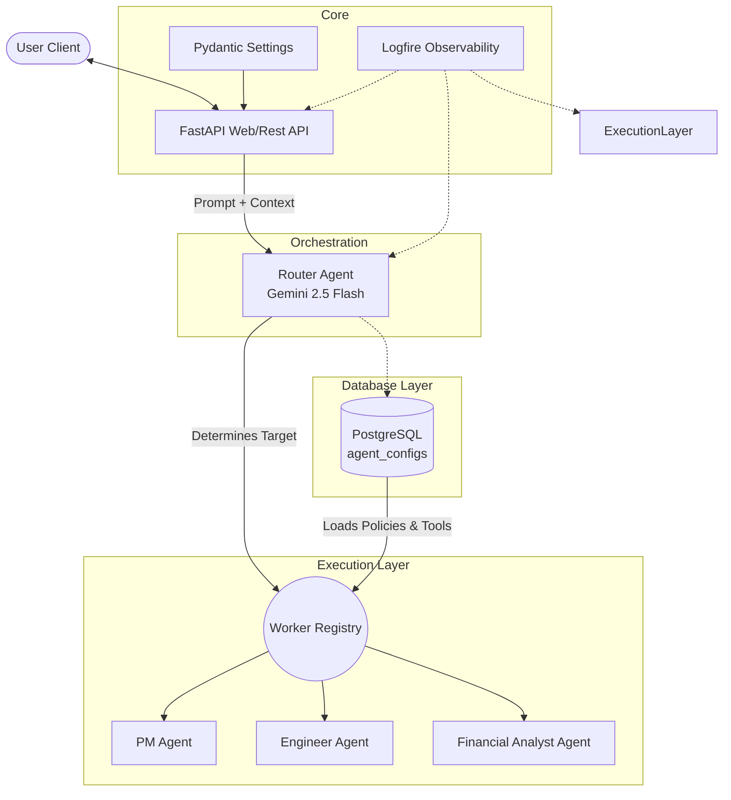
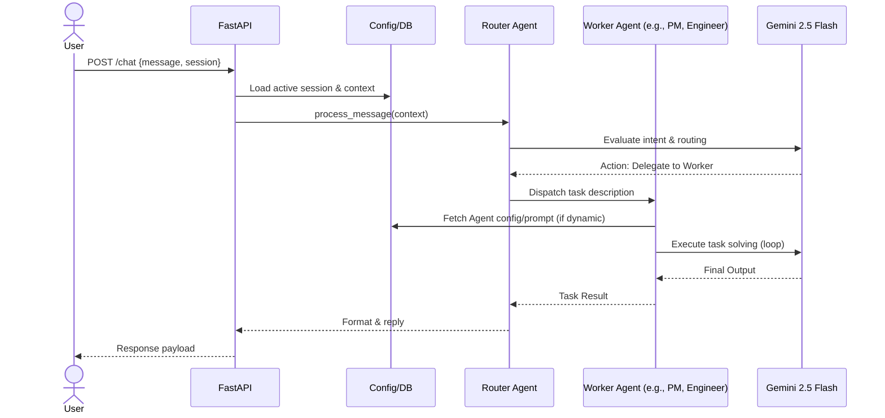

# Agent Router

An autonomous conversational AI middleware capable of scaling specialized workers dynamically. Using **Pydantic AI**, **FastAPI**, and a **PostgreSQL** persistence layer, the application accepts user input, leverages a "Router Agent" to perform intent classification, and delegates complex specialized tasks to configurable "Worker Agents". 

---

## 🏗 High-Level Architecture

The architecture models a 3-layer system:
- **Directive Layer**: External requests through FastAPI REST endpoint.
- **Orchestration Layer**: A Router Agent evaluating intent against an exact structured schema.
- **Execution Layer**: Specific roles (e.g. Project Manager, Engineer) instantiated dynamically at startup from PostgreSQL configurations.



## 🔄 Sequence Flows

**Standard Task Delegation Flow**


## ⚖️ Design Choices & Trade-Offs

| Decision | Pros | Cons |
| :--- | :--- | :--- |
| **Pydantic AI over LangChain** | Typesafe, Pythonic structured outputs natively out of the box with zero-overhead configuration. | Nascent ecosystem, relatively sparse tooling registry, and occasional breaking API output changes (e.g., `RunResult.data` vs `.output`). |
| **PostgreSQL Driven Agents** | Decouples application restart logic from runtime role assignment. Highly scalable. | Demands robust local database environments (Docker required even locally). Slows down boot times slightly. |
| **Pydantic Settings & `.env`** | Industry standard, inherently typesafe validation for credentials immediately avoiding runtime explosions. | Difficult debugging if variable precedence overlaps with host OS variables unknowingly. |

## 📁 Project Structure

```text
agent-router/
├── .env                  # Secrets and DB credentials
├── .tmp/                 # Scraped data & intermediate LLM data (Ignored)
├── agent_output/         # Safe restrict sandbox for Worker Agent File Generation
├── docker-compose.yml    # Database infrastructure (Postgres & PGAdmin)
├── main.py               # FastAPI application, startup logic & REST endpoints
├── pyproject.toml        # uv Dependency configuration
│
├── core/
│   ├── config.py         # Global settings loading
│   └── observability.py  # Logfire Configuration
│
├── db/
│   ├── agent_config.py   # Database mapping and agent configurations 
│   ├── schema.py         # Table definition and initial setup population
│   └── session.py        # AsyncPG connection pools
│
├── models/
│   └── api.py            # FastAPI Request/Response structures
│
├── agents/
│   ├── router.py         # Dynamic routing logic parsing LLM targets
│   └── workers.py        # Abstract dynamically-initialized workers
│
└── tools/
    ├── api_tools.py      # HTTP helper functions
    ├── fs_tools.py       # Sandbox Local File I/O
    └── registry.py       # Pointers translating DB strings to Py Functions
```

## 🚀 Quick Start Guide

**1. Prerequisites**
- Install `uv` for python dependencies.
- Install Docker for the database containers.
- Have a Gemini API key.

**2. Setup Environment**
Duplicate the `.env.template` into a local `.env` file and insert your credentials.
```bash
cp .env.template .env
```
_Ensure `GEMINI_API_KEY` is populated._

**3. Start the Database**
Launch the PostgreSQL engine in the background:
```bash
docker-compose up -d
```

**4. Run the Application**
Start the FastAPI server (using `uv run` will automatically install the project's dependencies if not yet synced):
```bash
uv run uvicorn main:app --reload
```
_On the first launch, the `lifespan` event will automatically populate your PostgreSQL database with the default Agent Roles and Tools via `db/schema.py`._

**5. Testing**
Navigate to the Swagger UI available at:
`http://localhost:8000/docs`
You can post a request directly to the `/chat` route to see the Router automatically decide whether to handle it or delegate it to a Worker Agent!
